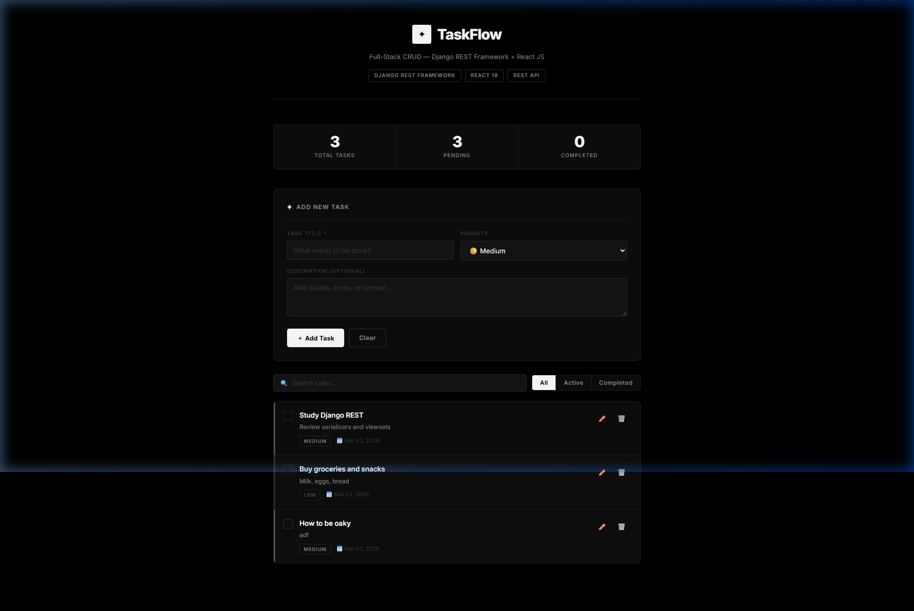
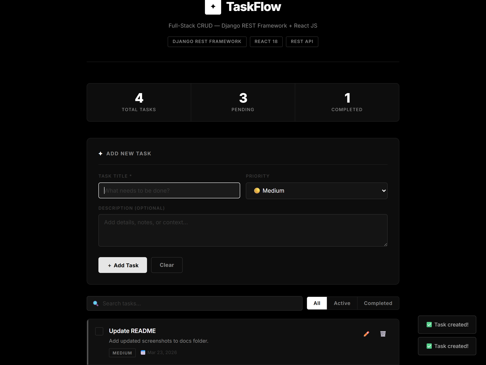
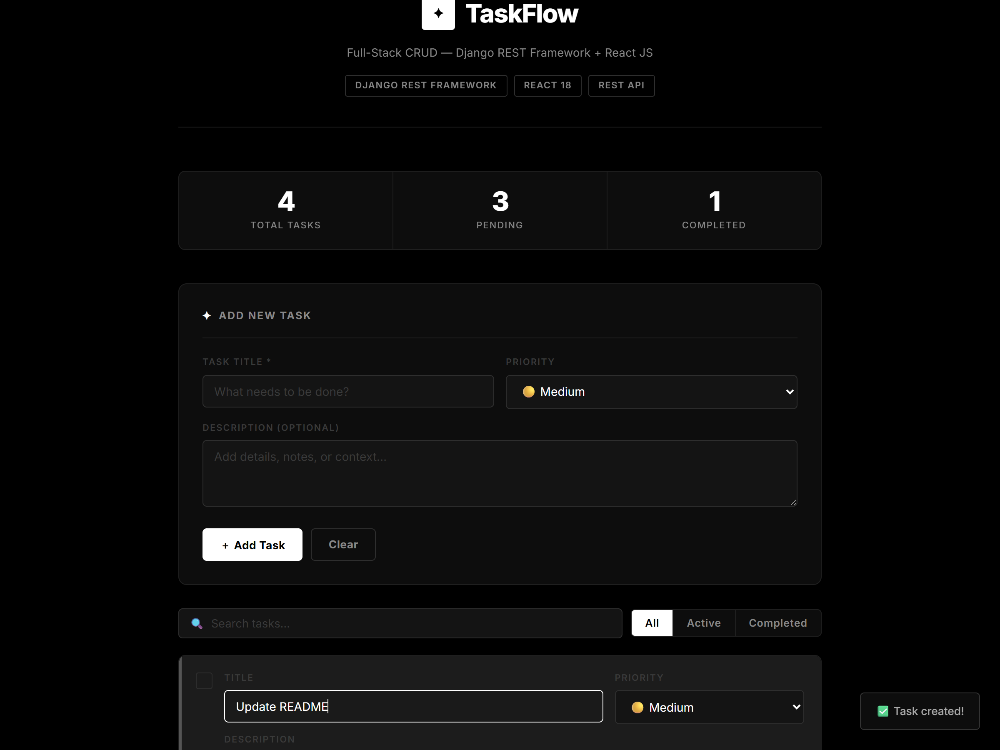
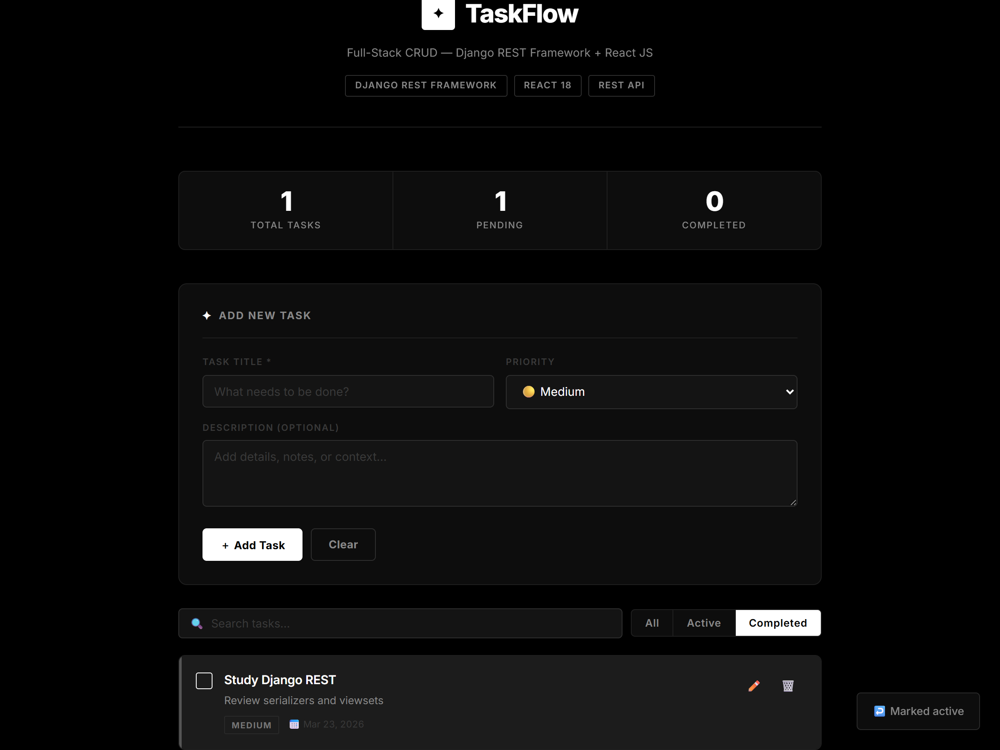
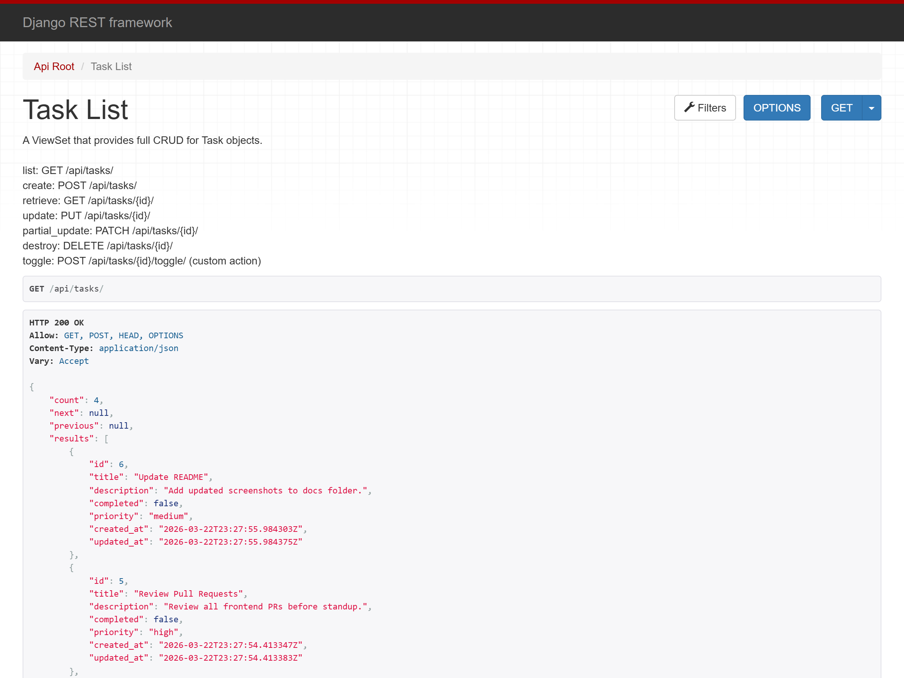

# TaskFlow — Full-Stack CRUD Application

A clean, minimal task manager demonstrating full **Create · Read · Update · Delete** operations across a decoupled full-stack architecture.

**Backend** → Django REST Framework · SQLite  
**Frontend** → React 19 + Vite (Modern SPA)

---

## Screenshots

### Full Application Overview

*Header, live stats bar (Total / Pending / Completed), Add Task form with priority selector, search and filter tabs, and the task list — all in a strict black & white editorial design.*

---

### Task List

*Tasks displayed in a unified bordered list. Each row shows title, description, outlined priority badge, and date. Left border thickness indicates priority level (bold white = high, mid gray = medium, faint = low). Edit ✏️ and delete 🗑️ actions on hover.*

---

### Inline Edit Mode

*Clicking the edit icon opens the edit form directly inside the card — no page navigation. Title, priority, and description are all editable in-place with Save / Cancel controls.*

---

### Completed Tasks

*Checked tasks are struck through and dimmed. The white checkbox fills solid on completion. Stats update in real time. Use the "Completed" filter tab to view only finished tasks.*

---

### REST API — Django REST Framework

*The DRF Browsable API at `http://127.0.0.1:8000/api/tasks/` — all endpoints documented inline with live JSON responses, HTTP method badges, and filter/search controls.*

---

## Project Structure

```
crud-django-react/
│
├── backend/                     # Django project
│   ├── manage.py
│   ├── requirements.txt
│   ├── db.sqlite3               # Auto-created after migrate
│   ├── backend/
│   │   ├── settings.py          # DRF + CORS + SQLite config
│   │   ├── urls.py              # Root URL → /api/
│   │   └── wsgi.py
│   └── tasks/                   # CRUD app
│       ├── models.py            # Task model
│       ├── serializers.py       # ModelSerializer
│       ├── views.py             # ModelViewSet + /toggle/ action
│       ├── urls.py              # DRF DefaultRouter
│       └── admin.py             # Admin panel config
│
├── frontend/                      # React SPA
│   ├── package.json
│   ├── vite.config.js
│   ├── index.html
│   └── src/
│       ├── main.jsx             # React entry point
│       ├── App.jsx              # Main UI Components
│       ├── api.js               # API Layer
│       └── index.css            # Styles & Tokens
│
├── docs/                        # README screenshots
└── README.md
```

---

## Tech Stack

| Layer | Technology |
|-------|-----------|
| Backend framework | Django 4.2 |
| REST API | Django REST Framework 3.14 |
| CORS | django-cors-headers |
| Database | SQLite (file-based, zero config) |
| Frontend | React 19 (via Vite) |
| Dev Server | Vite |
| Fonts | Inter — Google Fonts |

---

## Setup & Running

### Prerequisites
- Python 3.10+ installed
- Node.js 18+ installed

---

### Running the Project

You can start **both** the backend Python API and frontend React server simultaneously with:

```powershell
.\start.bat
```

> The React dev server automatically opens at `http://localhost:5173` and talks to the Django API at port `8000`.

---

### Manual Setup (Without start.bat)

#### Start Backend
Open a terminal in the `backend/` folder:

```powershell
cd "crud-django-react\backend"
pip install -r requirements.txt
```

> **Tip:** Use a virtual environment to keep things clean:
> ```powershell
> python -m venv venv
> venv\Scripts\activate
> pip install -r requirements.txt
> ```

---

### Step 2 — Run migrations

```powershell
python manage.py makemigrations tasks
python manage.py migrate
```

---

### Step 3 — Start the server

```powershell
python manage.py runserver
```

The API is now live at **`http://127.0.0.1:8000`**

---

#### Start Frontend

Open a new terminal in the `frontend/` folder:

```powershell
cd "crud-django-react\frontend"
npm install
npm run dev
```

> The React dev server automatically opens at `http://localhost:5173`.

---

## API Reference

Base URL: `http://127.0.0.1:8000/api/`

| Method | Endpoint | Description |
|--------|----------|-------------|
| `GET` | `/api/tasks/` | List all tasks |
| `POST` | `/api/tasks/` | Create a new task |
| `GET` | `/api/tasks/{id}/` | Retrieve a task |
| `PUT` | `/api/tasks/{id}/` | Full update a task |
| `PATCH` | `/api/tasks/{id}/` | Partial update a task |
| `DELETE` | `/api/tasks/{id}/` | Delete a task |
| `POST` | `/api/tasks/{id}/toggle/` | Toggle completed status |

### Query Parameters

| Parameter | Example | Effect |
|-----------|---------|--------|
| `search` | `?search=django` | Search title & description |
| `completed` | `?completed=true` | Filter by status |
| `priority` | `?priority=high` | Filter by priority level |
| `ordering` | `?ordering=-created_at` | Sort results |

### Example Request & Response

**POST** `/api/tasks/`
```json
{
  "title": "Review PR",
  "description": "Check open pull requests before standup",
  "priority": "high",
  "completed": false
}
```

**Response `201 Created`**
```json
{
  "id": 5,
  "title": "Review PR",
  "description": "Check open pull requests before standup",
  "completed": false,
  "priority": "high",
  "created_at": "2026-03-23T04:20:00Z",
  "updated_at": "2026-03-23T04:20:00Z"
}
```

---

## Task Model

| Field | Type | Default | Notes |
|-------|------|---------|-------|
| `id` | Integer | auto | Primary key |
| `title` | CharField(200) | — | Required |
| `description` | TextField | `""` | Optional |
| `completed` | BooleanField | `false` | Toggle via UI or `/toggle/` |
| `priority` | CharField | `"medium"` | `low` / `medium` / `high` |
| `created_at` | DateTimeField | auto | Set on creation |
| `updated_at` | DateTimeField | auto | Updated on every save |

---

## UI Features

| Feature | Details |
|---------|---------|
| **Create** | Form with title, priority dropdown, and optional description |
| **Read** | Live-fetched task list with search and filter tabs |
| **Update** | Inline edit — opens inside the card, no page reload |
| **Delete** | Confirmation dialog before deletion |
| **Toggle complete** | Click the checkbox; stats update instantly |
| **Search** | Debounced live search across title and description |
| **Filter** | All · Active · Completed tab switcher |
| **Toasts** | Non-blocking feedback for every action |

---

## Django Admin

Create a superuser and manage tasks via the built-in admin panel:

```powershell
python manage.py createsuperuser
```

Then visit: **`http://127.0.0.1:8000/admin/`**

---

## Dependencies

```
django>=4.2,<5.0
djangorestframework>=3.14
django-cors-headers>=4.3
```
